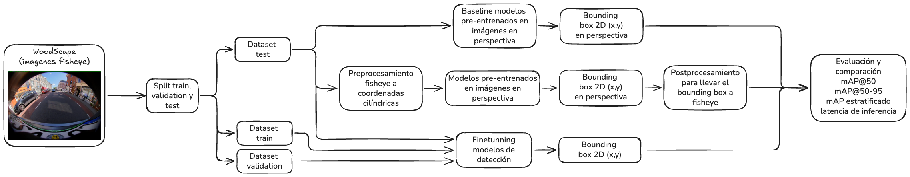

# Detección de objetos en imágenes fisheye automotrices

Trabajo práctico final de **Visión por Computadora II** (CEIA — FIUBA), grupo 1.

Comparación de estrategias de adaptación de modelos preentrenados frente a la
distorsión radial de las cámaras de surround view.

**Integrantes**

- Franco Marcelo Morero
- Nicolás Granato
- Marcos Levi Riveros Koloszwa
- Tadeo Rivero

---

## 1. Problema

Los sistemas de surround view de los vehículos actuales (cámara de
estacionamiento, frontal y laterales en los espejos) usan lentes ojo de pez con
campos de visión cercanos a 190°. La proyección resultante deforma los objetos en
función de su posición en la imagen.

Eso tensiona un supuesto sobre el que se apoyan las CNN. Las convoluciones son
equivariantes a la traslación, y esa equivarianza se sostiene sobre el
*weight sharing*: el mismo filtro es válido en cualquier posición porque se asume
homogeneidad espacial de la estadística de la imagen. Bajo proyección fisheye ese
supuesto se rompe — un peatón a 20° del eje óptico y el mismo peatón a 100° tienen
geometrías marcadamente distintas.

**Pregunta de investigación:** ¿cuánto se degrada un detector preentrenado hacia
la periferia del campo de visión, y qué estrategia de adaptación recupera mejor
ese desempeño?

---

## 2. Diseño experimental

Un factorial 2×2 que cruza corrección geométrica con adaptación de dominio:

| | sin fine-tuning | con fine-tuning |
|---|---|---|
| **sin rectificar** | Rama 1 — baseline | Rama 3 — adaptación por datos |
| **rectificado** | Rama 2 — proyección cilíndrica | Rama 4 — ambas |

El diseño permite estimar por separado el efecto de rectificar `(2−1)` y `(4−3)`,
el efecto de entrenar en el dominio `(3−1)` y `(4−2)`, y la interacción entre
ambos. La hipótesis es que la corrección geométrica aporta menos cuando el modelo
ya fue expuesto a datos fisheye, porque el fine-tuning aprende la deformación de
los datos.



Las cuatro ramas usan **YOLO26m**, la misma resolución de entrada, el mismo mapeo
de clases y el mismo presupuesto de épocas. Lo único que varía entre celdas es el
factor bajo estudio.

**Nota sobre la rectificación.** Se usa proyección cilíndrica y no perspectiva:
la proyección perspectiva diverge al aproximarse a 90° del eje óptico, de modo
que rectificar a plano obligaría a recortar el campo de visión y eliminaría
justamente la región periférica que el trabajo busca medir. Las detecciones de
las ramas 2 y 4 se remapean al espacio fisheye original antes de evaluar, para
que las cuatro ramas se midan en el mismo sistema de coordenadas.

---

## 3. Dataset

[WoodScape](https://woodscape.valeo.com/) de Valeo
([repositorio](https://github.com/valeoai/WoodScape),
[paper](https://arxiv.org/abs/1905.01489)), release público de 8234 imágenes de
cuatro cámaras fisheye (FV, MVL, MVR, RV) con anotaciones de instancia y
calibración intrínseca y extrínseca por imagen.

Descarga: Kaggle, dataset `subarnadasgupta/woodscapes`. La calibración se obtiene
del repositorio oficial de Valeo.

### Clases

Las 43 etiquetas de instancia de WoodScape se agrupan en tres clases de objeto
(`config/class_map.json`):

| id | clase | etiquetas de origen | instancias |
|---|---|---|---|
| 0 | `vehicle` | car, van, bus, truck, trailer, caravan | 54.422 |
| 1 | `person` | person, rider | 24.142 |
| 2 | `two_wheeler` | bicycle, motorcycle | 21.431 |

Las categorías de agrupación (`grouped_vehicles`,
`grouped_pedestrian_and_animals`) se excluyen por representar regiones de
multitud y no instancias individuales. `rider` se asigna a `person` siguiendo el
criterio de COCO. Se descartan cajas menores a 300 px² o con algún lado menor a
8 px.

---

## 4. Metodología

### 4.1 Partición sin fuga de información

WoodScape proviene de grabaciones continuas, por lo que un muestreo aleatorio a
nivel imagen podría repartir frames casi idénticos entre entrenamiento y prueba e
inflar las métricas por memorización. Como el efecto beneficiaría a las cuatro
ramas por igual, invalidaría la comparación.

Se verificó mediante hashes perceptuales de 256 bits:

1. **El release público no contiene secuencias contiguas.** La distancia de
   Hamming entre imágenes de índices consecutivos (mediana 60 bits) resultó mayor
   que la distancia al vecino más cercano global, indicando que el orden de los
   archivos no conserva estructura temporal.
2. **El conjunto de prueba quedó limpio.** La distancia mediana entre cada imagen
   de prueba y su vecino más próximo del conjunto de entrenamiento es de 39 bits
   sobre 256 (15,2%). Se detectó un único par por debajo del umbral de alerta y
   la imagen de entrenamiento involucrada fue excluida.

Partición resultante: 6148 imágenes de entrenamiento, 1085 de validación y 1000
de prueba, estratificadas por cámara (FV 247, MVL 251, MVR 261, RV 241). Los
parámetros y la semilla quedan registrados en `splits/split_config.json`.

### 4.2 Métrica estratificada por ángulo de incidencia

Para medir la degradación periférica se reporta el mAP estratificado según el
**ángulo de incidencia θ** respecto del eje óptico, y no según la distancia
radial en píxeles. θ se obtiene invirtiendo numéricamente el modelo de distorsión
de cuarto orden provisto en la calibración:

rho(θ) = k₁·θ + k₂·θ² + k₃·θ³ + k₄·θ⁴

Se eligió θ por dos razones: es la magnitud física que gobierna la deformación, y
permite comparar cámaras con calibraciones distintas — el conjunto incluye 23
juegos de parámetros intrínsecos, de modo que un mismo radio en píxeles
corresponde a ángulos diferentes según la cámara. Los bordes laterales de la
imagen están a unos 75° de incidencia y las esquinas a 110°, consistente con el
campo de visión nominal.

El esquema de evaluación replica el mecanismo `areaRng` de COCO: al evaluar un
anillo, los objetos de referencia externos se marcan como *ignore* en lugar de
eliminarse, y una detección que coincide con un objeto ignorado no se contabiliza
como falso positivo. **La implementación del AP se validó contra `pycocotools`,
con coincidencia a cuatro decimales** en mAP@50 y mAP@50-95.

Los límites de los anillos se fijaron en los terciles empíricos de la
distribución angular (68,3° y 80,7°), de modo que los tres contengan 3970 objetos
cada uno, y se mantienen congelados en `config/rings.json` para todas las ramas.

### 4.3 Métricas reportadas

mAP@50 y mAP@50-95, global y por anillo de incidencia; AP por clase; el cruce
anillo × tamaño de objeto como control; y latencia de inferencia medida con
warm-up sobre el mismo hardware para las cuatro ramas.

---

## 5. Resultados de la rama 1 (baseline)

YOLO26m pre-entrenado en COCO, inferencia directa sobre las 1000 imágenes de
prueba (`notebooks/rama1_baseline.ipynb`):

| anillo | θ | n_gt | mAP@50 | mAP@50-95 |
|---|---|---|---|---|
| centro | < 68,3° | 3970 | 0,5469 | 0,3605 |
| medio | 68,3–80,7° | 3970 | 0,4534 | 0,2951 |
| periferia | > 80,7° | 3970 | 0,1712 | 0,1021 |
| global | — | 11910 | 0,3944 | 0,2522 |

El detector pierde el 69% de su mAP@50 entre el anillo central y el periférico.
Frente a la versión preliminar con YOLOv8m (0,374 global y 0,164 en periferia),
YOLO26m mejora el centro pero deja la periferia prácticamente igual: un detector
genérico más reciente no resuelve la distorsión.

Para descartar que el fenómeno se explique por la reducción de escala aparente
que introduce la proyección, se estratificó simultáneamente por ángulo y por
tamaño de objeto según los rangos de área de COCO (mAP@50):

| anillo | chico | mediano | grande |
|---|---|---|---|
| centro | 0,252 | 0,618 | 0,802 |
| medio | 0,110 | 0,469 | 0,691 |
| periferia | 0,021 | 0,164 | 0,486 |

La degradación persiste dentro de cada rango de tamaño, lo que indica un efecto
geométrico y no un artefacto de escala. La pérdida relativa es del 92% en objetos
pequeños y del 39% en grandes: la deformación resulta más destructiva cuanto menor
es la cantidad de píxeles que describen al objeto.

Por clase, `vehicle` es la más afectada (AP@50 de 0,774 en el centro a 0,159 en la
periferia) y las cámaras laterales rinden mucho peor que la frontal y la trasera
(mAP@50 0,28 en MVL/MVR contra 0,54 en FV y 0,51 en RV). Latencia: 11,7 ms por
imagen (85 FPS) en una RTX 4080 SUPER.

---

## 6. Estructura del repositorio

```
notebooks/
    rama1_baseline.ipynb          detección directa sobre fisheye
    rama2_cilindrica.ipynb        proyección cilíndrica + remapeo inverso
    rama3_finetune.ipynb          fine-tuning sobre fisheye
    rama4_cilindrica_finetune.ipynb
tools/
    make_test_split.py            partición con auditoría de casi-duplicados
    verify_split.py               verificación por sha256 de una copia local
    convert_to_yolo.py            polígonos de instancia a cajas YOLO
    build_calibration.py          consolidación de la calibración de Valeo
    predict_baseline.py           inferencia y medición de latencia
    eval_radial.py                mAP global y estratificado por θ
    inspect_annotations.py        inspección del esquema de anotaciones
config/
    class_map.json                WoodScape -> 3 clases
    coco_map.json                 COCO -> 3 clases
    rings.json                    cortes de anillo congelados
    calibration.json              calibración consolidada de las 8234 imágenes
splits/
    test_1000.txt, train_pool.txt, quarantine.txt
    manifest.csv                  cámara, grupo, split y sha256 por imagen
    split_config.json             parámetros y semilla
    leakage_audit.csv             pares test-train más próximos
outputs/                          predicciones, métricas y figuras (no versionado)
vpc2_fisheye.png                  diagrama del trabajo
```

---

## 7. Reproducibilidad

**Requisitos:** Python `>=3.11,<3.13` y [uv](https://docs.astral.sh/uv/).

```bash
uv sync
```

### Preparar los datos

```bash
# 1. Descargar WoodScape de Kaggle (subarnadasgupta/woodscapes) y descomprimir.
#    Debe quedar <raiz>/rgb_images y <raiz>/instance_annotations

# 2. Verificar que la copia local coincide con la partición oficial
uv run python tools/verify_split.py --root <raiz> --split-dir splits/

# 3. Generar las etiquetas YOLO (no copia imágenes: data.yaml apunta al origen)
uv run python tools/convert_to_yolo.py --root <raiz> --split-dir splits/ \
    --out-dir outputs/yolo_ds --class-map config/class_map.json
```

El paso 3 debe producir 99.995 cajas sobre 8233 imágenes. Un número distinto
indica una versión diferente de `class_map.json`.

### Reproducir una rama

```bash
# Inferencia con modelo preentrenado (ramas 1 y 2)
uv run python tools/predict_baseline.py --yolo-dir outputs/yolo_ds \
    --modelo yolo26m.pt --out outputs/pred/rama1 --coco-map config/coco_map.json

# Evaluación estratificada (las cuatro ramas)
uv run python tools/eval_radial.py --yolo-dir outputs/yolo_ds \
    --pred-json outputs/pred/rama1/pred.json --out outputs/resultados/rama1 \
    --calibration config/calibration.json --rings-file config/rings.json \
    --cruce-tamano --etiqueta rama1
```

La partición se puede regenerar desde cero con `tools/make_test_split.py`
usando la semilla registrada en `splits/split_config.json`; el resultado es
idéntico.

---

## 8. Licencia y atribución

Este trabajo utiliza el **Valeo WoodScape Dataset**, cuyos términos de uso
restringen su empleo a fines de investigación, docencia y experimentación
personal, y exigen incluir una referencia al dataset en todo material público
derivado: https://woodscape.valeo.com/

```
@inproceedings{yogamani2019woodscape,
  title={WoodScape: A multi-task, multi-camera fisheye dataset for autonomous driving},
  author={Yogamani, Senthil and others},
  booktitle={Proceedings of the IEEE/CVF International Conference on Computer Vision},
  year={2019}
}
```

El análisis completo y la discusión de resultados están en el paper (formato
conferencia IEEE).
